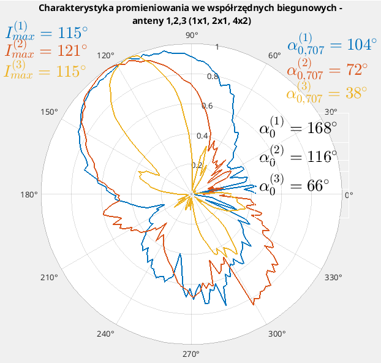
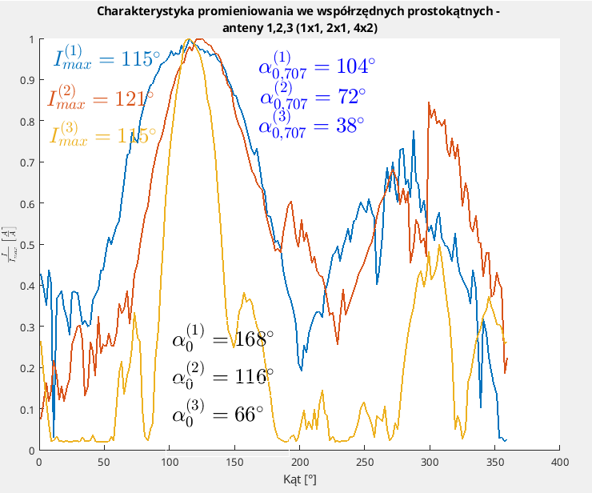

# Stuff
This repo was originally my idea to store small and insignificant to my future career and education files which I wanted to show of on github.

When I am writing this (20.04.2025) I came back to bring fresh air to it and kind of give it a new purpose. New-old purpose to be exact - it will act as a big basket with console/window aplications I made for <strong>some actual purpose</strong> and not only to "understand if statement in dart".

That was it for the intro, now lets explore the files:

## Contents

- [Podstawy_programowania](#podstawy_programowania)
    Minor console project for a grade.
- [Algorithms](#algorithms)
    I try to recreate and understand algorithms here
- [C++Playgound](#c-playground)
    Bruh - its a c++ playground B).
- [Antenna](#antenna)
    Matlab script that lets me create graps related to anthenas fast.

---
## Podstawy_programowania
<strong>COMPLETED</strong>
    
Its a project I made to pass a class at my university. Its a console application whose main attractive feature was colors of diffrent parts of text on the screen. It wasnt complex or fun - it taught me a little about manipulating text in console with C++, but what kind of quality in todays programming enviroment is it?

## Algorithms
<strong>WILL DEFFINITELLY DO MORE IN THE FUTURE</strong>
    
Some algorithms I tried too understand bycoding them in Python or C++ - mainly sorting ones and some ciphers as well

## C++ Playground
<strong>A MESS - SOMEWHAT COMPLETED, SOMEWHAT DISCONTINUED, SOMEWHAT IDK</strong>
    
Some console apps I made with C++ 
    - casino simulator (not really but somewhat accurate name)
    - Language Manipulator in which you can make strings such as RERERERERERERE with commands and when lazy
    - Math - which was an attempt to make non-decimal fractions and mathematical vectors

## Antenna
<strong>COMPLETED - MIGHT MAKE MORE OF IT IN THE FUTURE</strong>
    
Matlab script I created to draw standarized antenna radiation graphs - for purpose of my education, passing the class and as an excuse to learn some Matlab (Excel cant do these)

    
    
    
File doesnt generate ALL OF IT as on the photos, but besides alpha0 which I needeed to add manualy, everything can be done with minor edditing for 2 minutes

